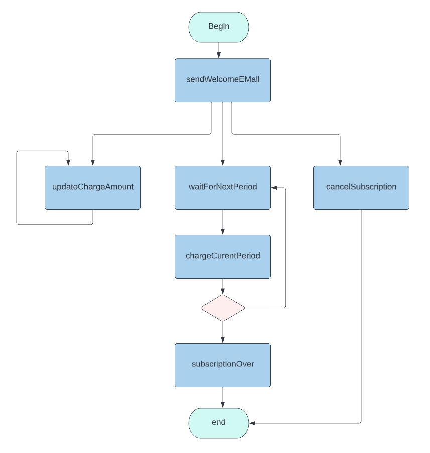

## Subscription workflow

This is an example as a
translation of the [ Subscription workflow](https://cadenceworkflow.io/docs/concepts/workflows/#example)

Based on the workflow definition, a diagram can be drawn easily to illustrate the flow.

Imagine if you want to add some sleeping in somewhere of the workflow, you can add it right away without any versioning, and
* It will take into affect for any newly started workflow
* It will also take affect for any existing started workflow

